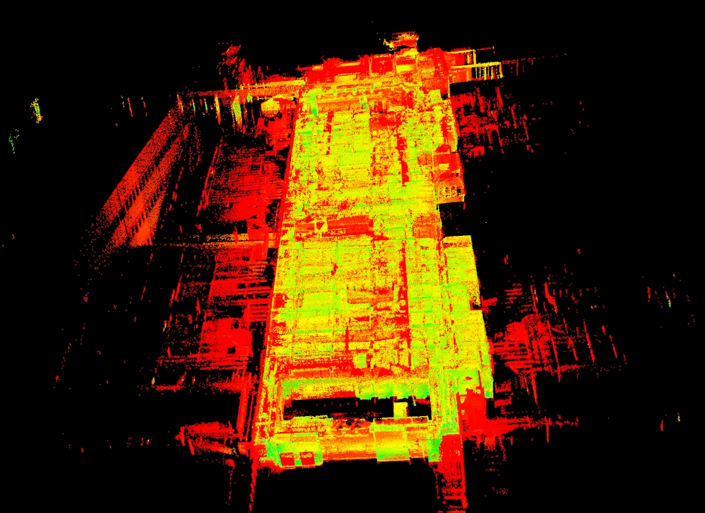
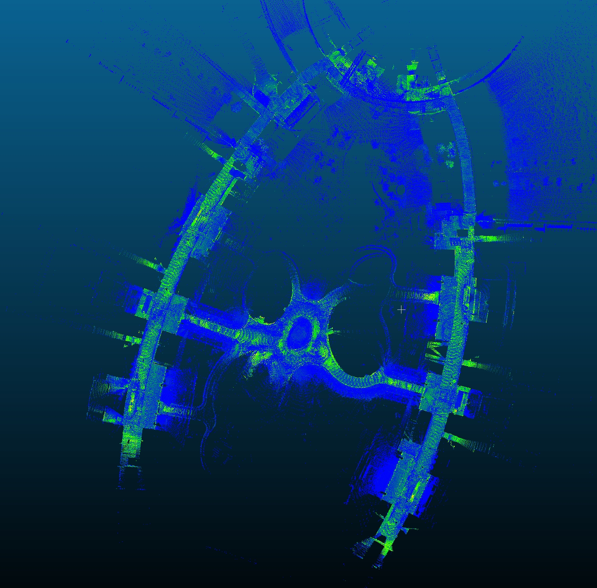
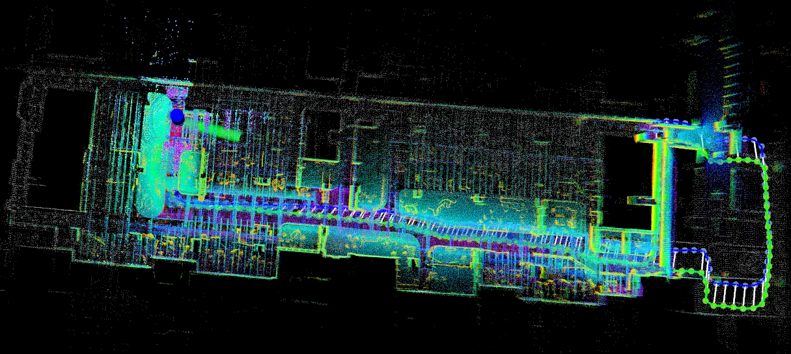
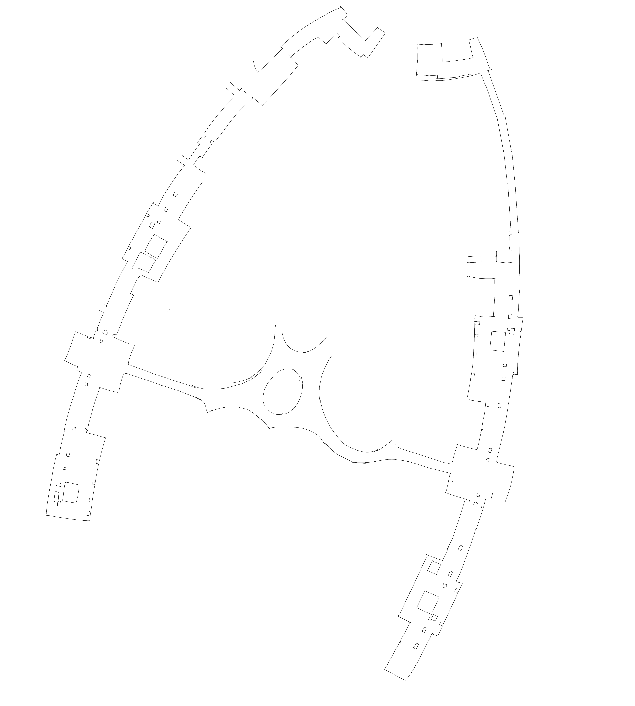

## gbx_navigation

update on 17/11/2024

## Related Repository

> Complete the navigation function with lidar positioning and ros_navigation

`navigation_config`： Contains all the parameter files needed for ros_navigation.

`fast_lio`：https://github.com/hku-mars/FAST_LIO

`fast_lio_sam_qn`：https://github.com/engcang/FAST-LIO-SAM-QN

`fast_lio_localization_qn` : Base on https://github.com/engcang/FAST-LIO-Localization-QN

`ranger_mini_v2` :  Base on https://github.com/agilexrobotics/ugv_gazebo_sim,
(Cut out the original huge package and keep only the parts that are relevant to ranger_mini_v2.)

`ros environment` : https://wiki.ros.org/noetic/Installation/Ubuntu (base on your device)

## Videos

> [Testing Indoor](https://www.bilibili.com/video/BV1svU7YXECV/?vd_source=1fa8466b3aa53e37bc9d2f8fa7690ac7)

## Prerequisites

+ `C++` >= 17
+ `OpenMP` >= 4.5
+ `CMake` >= 3.10.0
+ `Eigen` >= 3.3
+ `PCL` >= 1.9
+ `Boost` >= 1.54
+ `ROS` >= Noetic

- [`GTSAM`](https://github.com/borglab/gtsam)

```
wget -O gtsam.zip https://github.com/borglab/gtsam/archive/refs/tags/4.1.1.zip
unzip gtsam.zip
cd gtsam-4.1.1/
mkdir build && cd build
cmake -DGTSAM_BUILD_WITH_MARCH_NATIVE=OFF -DGTSAM_USE_SYSTEM_EIGEN=ON ..
sudo make install -j16
```

- [`Teaser++`](https://github.com/MIT-SPARK/TEASER-plusplus)

```
git clone https://github.com/MIT-SPARK/TEASER-plusplus.git
cd TEASER-plusplus && mkdir build && cd build
cmake .. -DENABLE_DIAGNOSTIC_PRINT=OFF
sudo make install -j16
sudo ldconfig
```

## Build Modules

- `tbb` (is used for faster `Quatro`)

```
sudo apt install libtbb-dev
```

- Build `Quatro` and `nano_gicp`

```
sudo apt install cmake libeigen3-dev libboost-all-dev

cd ~/your_workspace/src/VIP_ROBOT/third_party
git clone git@github.com:url-kaist/Quatro.git
git clone git@github.com:engcang/nano_gicp.git
cd ~/your_workspace

# nano_gicp, quatro first
catkin build nano_gicp -DCMAKE_BUILD_TYPE=Release

# build quatro
catkin build quatro -DCMAKE_BUILD_TYPE=Release -DQUATRO_TBB=ON -DQUATRO_DEBUG=OFF
catkin build -DCMAKE_BUILD_TYPE=Release
```

- [`Fast-lio`](https://github.com/hku-mars/FAST_LIO)

You have cloned the fast_lio source code by cloning our Repository in ./fast_lio

You can just run this code and get the whole Point Cloud map.

```
# build fast_lio
catkin build fast-lio

# Run the launch file based on your device (./fast_lio/launch)
roslaunch fast_lio $your_device_launch$.launch
```

**FAST-LIO point cloud map (pcl_viewer) -> HKUST(GZ) W1 5F Maker Space**



- [`Fast-lio-SAM-QN`](https://github.com/engcang/FAST-LIO-SAM-QN)

You have cloned the fast_lio_sam_qn source code by cloning our Repository in ./fast_lio_sam_qn

You can just run this code and get the whole Point Cloud map.

```
# build fast_lio_sam_qn 
catkin build fast_lio_sam_qn 

# You should change the yaml file in the launch based on your device (./fast_lio_sam_qn/launch/map_vipbot.launch)
roslaunch fast_lio_sam_qn map_vipbot.launch
```

**FAST-LIO_SAM point cloud map (CloudCompare) -> HKUST(GZ) Core teaching area**



- [`Fast-lio-Localization-QN`](https://github.com/engcang/FAST-LIO-Localization-QN)

You have cloned the fast_lio_localization_qn source code by cloning our Repository in ./fast_lio_localization_qn

You can just run this code and get the position data

```
# build fast_lio_localization_qn 
catkin build fast_lio_localization_qn 
```

Edit the ./fast_lio_lolization_qn/config/vipbot_config.yaml: **Line4: saved_map: for your result.bag path**

```
# You should change the yaml file in the launch based on your device (./fast_lio_localization_qn/launch/run_loc_qn.launch)
roslaunch fast_lio_localization_qn run_loc_qn.launch
```

**Localization in the point cloud map**



## RUN on the our Moving Platform

- open `roscore` , and `ouster os1` in `supervise.html`
- open a terminal and run:

```
roslaunch real_v1_config ranger_mini_v2.launch
```

- open a terminal and run:

```
roslaunch real_v1_config load_move_base.launch
```

and then operate in Rviz, like pub a destination.
​

### Tutorials:

> Introduce the logical structure and function of the component package.

> We put the whole modules together to start with a project

### navigation_config

All the running `launch` files are located in the `navigation_config` folder, and for convenience during final execution, each car is treated as a separate software package. The contents are listed in the following table:

| Name        | Content                                                      | Function                                                     |
| ----------- | ------------------------------------------------------------ | ------------------------------------------------------------ |
| config      | `move_base` and lidar-related `.yaml` parameter file         | `move_base` and lidar-related parameter loading              |
| launch      | `move_base`and lidar-related`.launch`parameter file          | Load the parameters `.yaml` file & start the node            |
| map         | `.png` and `.yaml` files for different sites                 | Provide `map_serve` to publish 2d maps                       |
| pcd         | `pcd` point cloud map from `fast_lio`/`fast_lio_sam`         | 2D`.png`（stored locally because it is too large）           |
| bag         | `fast_lio_sam` generates a `.bag` file that records keyframe | Provides key frame positioning                               |
| trajectory  | Trajectory generated by `navigation_tools/TopicGenTrajectory` `CSV` file | Loaded in `gbx_manual` and published to 'move_base'          |
| urdf/meshes | Robot `urdf` file/simulation `stl` file                      | Description of robot composition information/load model in simulation |
| rviz        | 'rviz' configuration file                                    | Save the files required by Rivz and fix the visual configuration |

### gbx_manual

> In order to allow users to interact with each node and build a unified running process

`STOP,MOVE,WAIT,PULL_OVER,ARRIVE` 5 states with `FSM` for managing the entire navigation cycle。

Provides the `/gbx_manual/pub_trajectory` service interface externally. During initialization, the trajectory in `navigation_config/real_v1_config/trajectory` is loaded. Upon receiving a request containing correct trajectory information, the trajectory point stored by the trajectory point will be released to `/click_point`.

E3_121 is our test room

```
rosservice call /gbx_manual/pub_trajectory "sender: 'user' path_name: 'E3_121'"
```

This sends the request E3_121 to `gbx_manual`


### How to run

> Use `roslaunch` instead of `mon launch` to load `fast_xxx` related `launch` files

**Version 1**

```bash
roslaunch real_v1_config load_manual.launch
```

Run the `load_manual.launch` file to do the following

- Load `global_costmap`, `local_costmap` and other configuration files required by `move_base` and start the node
- Load the configuration file of `map` and launch the `map_server` node to publish 2d map information on the `/map` topic
  Load the required configuration files for `fast_lio` and `fast_lio_localization_qn` and start the node
- Load static `tf_publisher` and robot `urdf` and `robot_state_publisher`
- Load the `cloud_transit` configuration file and start the node
- Load the `ranger_mini_v2` configuration file and start the node (Mini ranger 2)
- Load the `gbx_manual` configuration file and start the node


> In addition, these nodes can also be run separately, as shown in the following example:

- Only run `fast_lio`

```
roslaunch real_v1_config ouster_os1_mapping.launch
```

- Only run `fast_sam_localization_qn`

```
roslaunch real_v1_config ouster_os1_loc_qn.launch
```

- Only run mini ranger 2 controller

```
roslaunch real_v1_config ranger_mini_v2.launch
```


### Steps

#### 1. Mapping

Run`fast_lio` and `fast_lio_sam` for keyframe point cloud map `.bag` and `.pcd` file

```
roslaunch real_v1_config ouster_os1_sam.launch
```

#### 2. Localization

Run `fast_lio` and `fast_sam_localization_qn`，load `.bag` file

```
roslaunch real_v1_config ouster_os1_loc_qn.launch
```

#### 3. Generate 2d maps from pcd files

```
roslaunch pcd2pgm run.launch
rosrun map_server map_saver -f map_name
```

**2D map for planner**


#### 4.Load 2D map and `move_base`

```
roslaunch real_v1_config load_move_base.launch
```

#### 5.Load `manual`

```
roslaunch real_v1_config load_manual.launch
```

### Rosbag

We will publish the rosbag soon.


## Contributing

Yujie ZHOU, Siyang LIU, Kai ZHANG

## License

Null

## Contact

For questions or inquiries, please contact [Yujie ZHOU](yzhou118@connect.hkust-gz.edu.cn).